</img>

Penumbra is a simple Rendering Engine primarily built for Occlusion, a custom 3D game engine.  
Cross-platform but mainly tested and developed on Linux.  
Penumbra is part of the EcLibs project, a group of libraries and tools mainly focused on graphics and game development.  
Like with **Occlusion**, the name of this project is also related to eclipses. Why? Rule of cool.

It supports **BGFX** and **WebGPU** as backends (WebGPU via WGPU-Native).

## Important

This is a Work in Progress. As of now, only 2D Rendering is supported.

## What does it support?

- 2D and 3D Graphics via separate modules (Antumbra and Umbra respectively)
- Phong-based lighting and other simple experimental non-physically based lighting models
- Model loading

### What does it ACTUALLY support?

Right now it only supports simple 2D graphics lol.

## Building

Penumbra uses Meson as its build system. If you're using Meson you can use the library as a subproject.

### Test executable

The test executable is a simple application made to test specific parts of the library.

Setup the build:
```
meson setup build
```
Then compile it:
```
meson compile -C build
```

### Library

[Not yet. I'm still moving from a poorly made CMake file to Meson so I'm currently testing the executable.]

## Dependencies
### Utilities
- **bgfx-shaderc** (included with BGFX) \[Only if using BGFX as backend\]
- **toktx** \[Khronos Textures not supported with WebGPU Backend for now\]

### Libraries
- **BGFX** \[Only if using BGFX as backend\]
- **WGPU-Native**: Version 22.1.0.5 \[Only if using WebGPU as backend\]
- **GLFW**
- **GLM**
- **STB Image** (included)