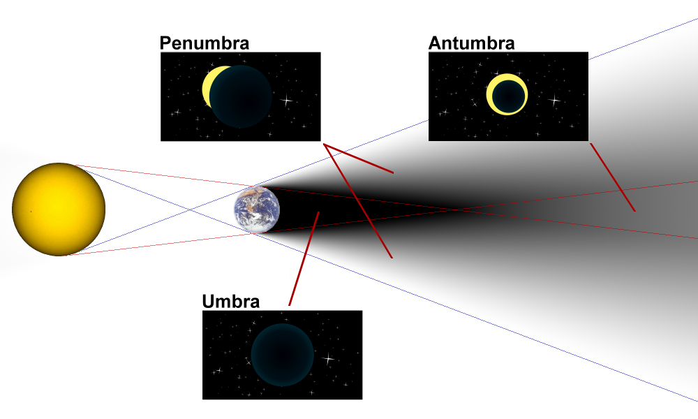

# Penumbra

Simple general-purpose BGFX Renderer built for Selengine.   
Cross-platform but primarily tested and developed on Linux.

## What does it support?

- 2D and 3D Graphics via separate modules (Antumbra and Umbra respectively)
- Simple phong-based lighting
- Model loading (From Hope-Soda files or normal files)

## What may be supported in the future?

**Not planned for now**

- 2D Normal Map support for better 2D Lighting
- PBR Lighting
- Shadow Mapping (ironic that it's not supported for now)

## Is there a lore reason why it's called like that?

Yes, there is.  
But seriously, it's called like that because of this diagram:

When in the penumbra you only see part of the light source, making only a moon shape visible, which is what "connects" it to the main project, Selengine.

The 3D module is called Umbra because it's where a total eclipse is visible, this has some relevance in my worldbuilding project so there is indeed a lore reason.

The Antumbra (2D module) would be an annular eclipse, which also looks nice and would resemble the thing in my project as well, but it's not as cool. As a worldbuilding enjoyer I must follow rule of cool so the simpler module has to be the less cool one.

~~Also, Ryu Ga Gotoku Studio's Judgment's Soundtrack is amazing and the track Penumbra goes way harder than it should.~~

## Dependencies
### Utilities
- bgfx-shaderc (included with BGFX)
- toktx

### Libraries
- BGFX
- GLFW
- GLM
- STB Image (included)

### Arch Linux Packages
- bgfx-cmake-git
- ktx_software-git
- glfw
- glm